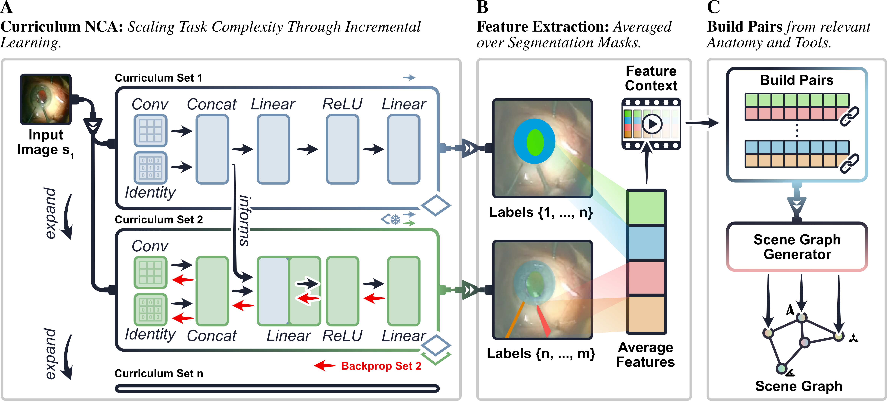

# Sterilizable Scene Graph Generation for Operating Rooms
This is the official implementation of our paper [Sterilizable Scene Graph Generation for Operating Rooms](https://arxiv.org/abs/2608.16469).  
Nick Lemke, Ssharvien Kumar Sivakumar, Antoine P. Sanner, John Kalkhof, Henry John Krumb, Ghazal Ghazaei, and Anirban Mukhopadhyay





## Installation
1. Set up a conda environment with ``conda create -n <your_conda_env> python=3.10``.
1. Install torch with your preferred CUDA version, e.g. ``pip3 install torch torchvision torchaudio --index-url https://download.pytorch.org/whl/cu118``.
1. Install other dependencies via ``pip install -r requirements.txt``.
1. (Optional) Log into wandb ``via wandb login``.
1. Specify paths in [``utils/paths.py``](./utils/paths.py).


## Setup

Download the datasets from the following links.
| Surgery | Dataset | Notes |
|-|-|-|
|Cholec|https://camma.unistra.fr/datasets/ | full videos |
|Cholec|https://www.kaggle.com/datasets/newslab/cholecseg8k | segmentation labels |
|Cholec|https://huggingface.co/SsharvienKumar/SASVi/tree/main/dataset | pseudo-segmentation |
|Cholec|https://github.com/CAMMA-public/cholect50/tree/master | scene graphs |
|Cataract|https://ieee-dataport.org/open-access/cataracts | full videos |
|Cataract|https://cataracts.grand-challenge.org/CaDIS/ | segmentation labels |
|Cataract|https://huggingface.co/SsharvienKumar/SASVi/tree/main/dataset | pseudo-segmentation |
|Cataract|https://github.com/felixholm/CAT-SG | scene graphs |

After downloading the data, you should preprocess the CholecSeg8k data using the [``preprocess_CholecSeg8k.ipynb``](./preprocess_CholecSeg8k.ipynb) notebook.
Also preprocess the cataract videos and cholec videos using these scripts: [``preprocess_cataract_videos.ipynb``](./preprocess_cataract_videos.ipynb) and [``preprocess_cholec80_videos.py``](./preprocess_cholec80_videos.py).
Also, you need to generate the data splits using [``split_cataracts.ipynb``](./split_cataracts.ipynb) and [``split_cholec.ipynb``](./split_cholec.ipynb).

## Usage
### Segmentation
You can train the segmentation models using ``train.py`` for the baseline models and ``train2.py`` for the class-incremental curriculum training of SG-NCA.  

### Scene Graph Generation
The scene graph generation algorithms are trained using ``train1.py``.


## Recreating Results

### Table 1 (Segmentation)
[``cholec_dice.ipynb``](./analysis/cholec_dice.ipynb) and [``cataracts_dice.ipynb``](./analysis/cataracts_dice.ipynb)
### Figure 3 (Quantitative Scene Graph Generation)
[``cholec_relation.ipynb``](./analysis/cholec_relation.ipynb) and [``cataracts_relation.ipynb``](./analysis/cataracts_relation.ipynb)
### Table 2 (SG-NCA Ablation Study)
[``dice_ablation.ipynb``](./analysis/dice_ablation.ipynb)
### Figure 4 (Qualitative Scene Graph Generation)
Run inference using [`inference.py`](./inference.py).
After that, [``qualitative.ipynb``](./analysis/qualitative.ipynb) and [``cataract_qualitative.ipynb``](./analysis/cataract_qualitative.ipynb)

### Table 3 (SG-NCA Temperature and Energy)
Measuring temperature is rather simple as you just need a thermometer to measure its temperature. Make sure to place the thermometer ~10cm next to the computing device and let it run for 40 minutes.
In our case, we used a [MLX90614](https://www.melexis.com/en/documents/documentation/datasheets/datasheet-mlx90614) thermometer and the [``measure_temperature.py``](./measure_temperature.py) script to read out its values.
After that you can use the [``vis_measurements.ipynb``](./analysis/vis_measurements.ipynb) notebook to visualize the results and generate the values for the table.

Since running the model itself and measuring the power draw is different per device we refer to the specific subsections.

#### Workstation
On the workstation, you can measure energy consumption using those commands:
```bash
watch nvidia-smi
watch -n1 'E1=$(sudo cat /sys/class/powercap/intel-rapl:0/energy_uj); sleep 1; E2=$(sudo cat /sys/class/powercap/intel-rapl:0/energy_uj); echo "CPU Watts: $(echo "scale=2; ($E2-$E1)/1000000" | bc)"'
```
You can execute the inference process using the [``measure_model.py``](./measure_model.py) script.

#### Raspberry Pi
On the Raspberry Pi, you can run SG-NCA using the same [``measure_model.py``](./measure_model.py) script. Since not all PyTorch versions are supported, we recommend installing ``pip install torch==2.9.0+cpu torchvision==0.24.0`` in an environment with python 3.10.
We measured the energy consumption using a USB energy tester. We used [this YOJOCK model](http://yojock.com/product/USBTester/821.html).


#### Smartphone
For benchmarking on the smartphone, we will use the generic ONNX android benchmark.
First, export SG-NCA to ONNX format using the [``export_model.py``](./export_model.py) script.
After that, compile the benchmark using the following commands:
```bash
git clone https://github.com/microsoft/onnxruntime
cd onnxruntime
python tools/ci_build/build.py \
    --update \
    --build \
    --build_dir build/Android \
    --android \
    --android_abi=arm64-v8a \
    --config Release \
    --build_shared_lib
```
After that, push all data to the smartphone. Make sure that your smartphone is connected to your PC and has developer settings activated.
```bash
adb push onnxruntime_perf_test /data/local/tmp/
adb shell chmod +x /data/local/tmp/onnxruntime_perf_test
adb push .\segmentation_sim.onnx /data/local/tmp/
```
Turn off charging via the cable (you may want to turn it on again afterwards).
```bash
adb shell dumpsys battery set ac 0
adb shell dumpsys battery set usb 0
```
Run the experiments for a large number of rounds
```bash
adb shell "/data/local/tmp/onnxruntime_perf_test /data/local/tmp/segmentation_sim.onnx -e cpu -r 120000 -I image:1,3,256,256"
```
Finally, you can measure the energy consumption via
```bash
adb shell dumpsys batterystats --reset
adb shell "/data/local/tmp/onnxruntime_perf_test /data/local/tmp/segmentation_sim.onnx -e cpu -r 1200 -I image:1,3,256,256"
adb shell dumpsys batterystats > stats.txt
```

## App deployment
Export demo data:
```bash
python export_demo_frames.py \
  --video /local/scratch/Cholec80/cholec80_full_set/videos/video01.mp4 \
  --output-dir app/app/src/main/assets/demo \
  --video-id VID01 \
  --start-frame 500 \
  --target-count 20 \
  --target-step 7
```
Export SG-NCA:
```bash
python export_model.py \
  --checkpoint /local/scratch/clmn1/videoNCA/CholecDataset/dazzling-carnation-75 \
  --output-dir app/app/src/main/assets/models \
  --validation-frames \
    app/app/src/main/assets/demo/frames/00000475.png \
    app/app/src/main/assets/demo/frames/00000479.png \
    app/app/src/main/assets/demo/frames/00000482.png \
    app/app/src/main/assets/demo/frames/00000486.png \
    app/app/src/main/assets/demo/frames/00000489.png \
    app/app/src/main/assets/demo/frames/00000493.png \
    app/app/src/main/assets/demo/frames/00000496.png \
    app/app/src/main/assets/demo/frames/00000500.png
```
Build the App in Android Studio: 
- Build apk: Main Menu (top left) > Build > Generate Signed App Bundle or APK
- Select APK -> Next -> Enter PW / Create Key -> create
- The app will be created here: ``./app/app/release``
- Run ``adb install -r ./app/app/release/app-release.apk``


## Citing SG-NCA
```
@misc{lemke2026sterilizablescenegraphgeneration,
      title={Sterilizable Scene Graph Generation for Operating Rooms}, 
      author={Nick Lemke and Ssharvien Kumar Sivakumar and Antoine P. Sanner and John Kalkhof and Henry John Krumb and Ghazal Ghazaei and Anirban Mukhopadhyay},
      year={2026},
      eprint={2608.16469},
      archivePrefix={arXiv},
      primaryClass={cs.CV},
      url={https://arxiv.org/abs/2608.16469}, 
}
```
